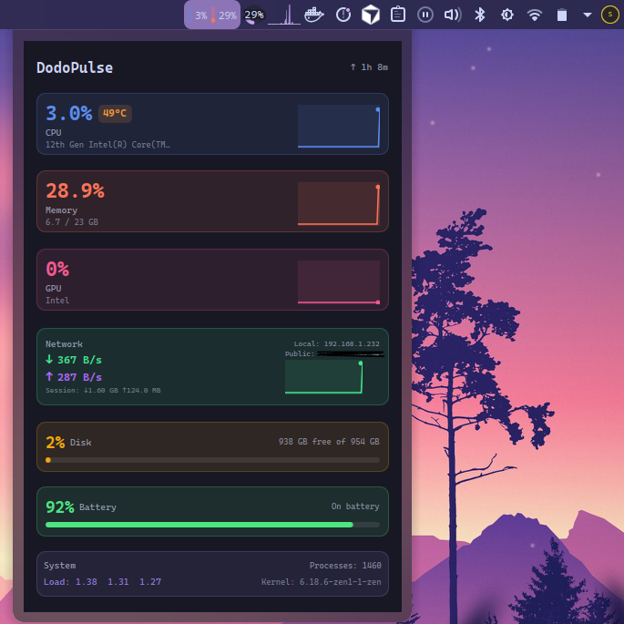

# DodoPulse KDE Plasma Widget

A lightweight system monitor widget for KDE Plasma with beautiful mini graphs.

## File Structure

```
dodopulse.plasmoid         # Distributable widget package
KDE/
├── metadata.json          # Widget metadata
├── install.sh            # Installation script
├── uninstall.sh          # Uninstall script
├── README.md             # English documentation
├── README_TR.md          # Turkish documentation
├── img/
│   └── example.png       # Screenshot
└── contents/
    ├── config/
    │   ├── config.qml    # Configuration menu
    │   └── main.xml      # Settings definitions
    └── ui/
        ├── main.qml              # Main widget file
        ├── CompactRepresentation.qml  # System tray view
        ├── FullRepresentation.qml     # Expanded view
        ├── configGeneral.qml     # Settings panel
        ├── MetricCard.qml        # CPU/Memory/GPU cards
        ├── NetworkCard.qml       # Network card
        ├── DiskCard.qml          # Disk card
        ├── SystemCard.qml        # System info card
        └── SparklineGraph.qml    # Graph component
```




## Features

- **CPU monitoring** - Usage percentage, temperature, core count with history graph
- **Memory monitoring** - Used/total memory with visual graph
- **GPU monitoring** - Utilization percentage, temperature (NVIDIA, AMD, Intel)
- **Network monitoring** - Download/upload speeds, local IP with history graph
- **Disk monitoring** - Usage percentage, free space with progress bar
- **System info** - Load average, process count, kernel version, uptime

### Visual Features

- Beautiful sparkline graphs with gradient fills
- Color-coded warnings (orange for high usage, red for critical)
- Smooth animations and hover effects
- Compact mode for system tray
- Configurable update intervals

## Requirements

- KDE Plasma 5.x or 6.x
- Qt 5.15+ or Qt 6.x
- For GPU monitoring:
  - NVIDIA: `nvidia-smi` (nvidia-utils package)
  - AMD: `amdgpu` kernel driver
  - Intel: `i915` kernel driver
- For temperature monitoring: `lm_sensors` (recommended)

## Installation

### Method 1: Using .plasmoid File (Recommended)

```bash
# GUI installation - double-click the file or:

# For Plasma 6:
kpackagetool6 -t Plasma/Applet -i dodopulse.plasmoid

# For Plasma 5:
plasmapkg2 -i dodopulse.plasmoid
```

### Method 2: Install Script

```bash
cd KDE
chmod +x install.sh
./install.sh
```

For system-wide installation:
```bash
sudo ./install.sh --system
```

### Method 3: Using plasmapkg2 from directory

```bash
plasmapkg2 -i KDE/
```

### Method 3: Manual Installation

```bash
mkdir -p ~/.local/share/plasma/plasmoids/com.dodoapps.dodopulse
cp -r KDE/* ~/.local/share/plasma/plasmoids/com.dodoapps.dodopulse/
```

## Usage

1. Right-click on your desktop or panel
2. Select "Add Widgets..."
3. Search for "DodoPulse"
4. Drag it to your desktop or panel

### Configuration

Right-click on the widget and select "Configure DodoPulse..." to access:

- **Update interval**: How often to refresh metrics (500ms - 10s)
- **Visible sections**: Toggle CPU, Memory, Network, Disk, GPU
- **Show temperature**: Display temperature readings
- **Compact mode**: Minimal view for system tray

## Uninstallation

```bash
./uninstall.sh
```

Or manually:
```bash
rm -rf ~/.local/share/plasma/plasmoids/com.dodoapps.dodopulse
```

Restart Plasma shell:
```bash
kquitapp5 plasmashell && kstart5 plasmashell
```

## Technical Details

DodoPulse reads system metrics from:

- **CPU**: `/proc/stat`
- **Memory**: `/proc/meminfo`
- **Network**: `/proc/net/dev`
- **Disk**: `df` command
- **Temperature**: `/sys/class/hwmon/` (lm_sensors)
- **GPU**:
  - NVIDIA: `nvidia-smi`
  - AMD: `/sys/class/drm/card*/device/gpu_busy_percent`
  - Intel: `/sys/class/drm/card0/gt/gt_cur_freq_mhz`

## Troubleshooting

### Widget not appearing
```bash
# For Plasma 6 (recommended):
systemctl --user restart plasma-plasmashell

# Or manually:
kquitapp6 plasmashell && kstart plasmashell

# For Plasma 5:
kquitapp5 plasmashell && kstart5 plasmashell
```

### GPU monitoring not working

For NVIDIA:
```bash
# Install nvidia-utils
sudo pacman -S nvidia-utils  # Arch
sudo apt install nvidia-utils  # Debian/Ubuntu
```

For AMD/Intel, ensure the kernel module is loaded:
```bash
lsmod | grep -E "amdgpu|i915"
```

### Temperature not showing

Install lm_sensors:
```bash
sudo pacman -S lm_sensors  # Arch
sudo apt install lm-sensors  # Debian/Ubuntu

# Detect sensors
sudo sensors-detect
```

## License

MIT License - see [LICENSE](../LICENSE) for details.

## Contributing

Contributions are welcome! Please feel free to submit a pull request.

---

Part of the [DodoPulse](https://github.com/dodoapps/dodopulse) project.
